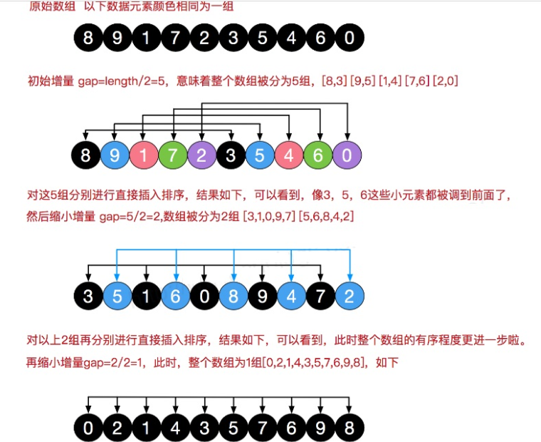
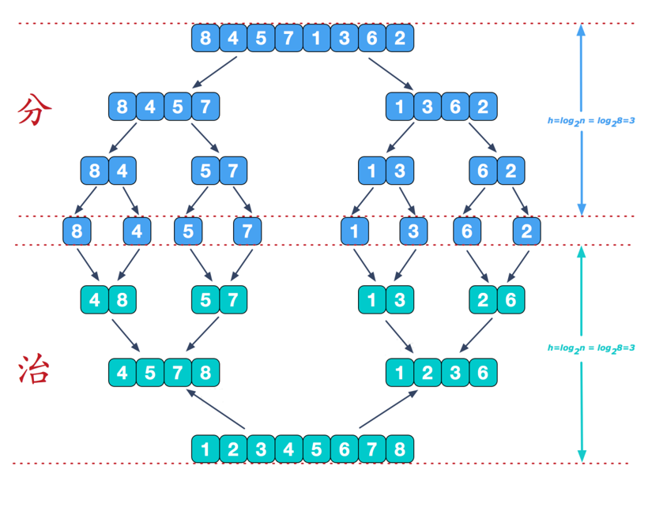

# DataStructuresAndAlgorithms
数据结构与算法

## **排序**

### 算法的时间复杂度

#### 平均时间复杂度和最坏时间复杂度
- 平均时间复杂度是指所有可能的输入实例均以等概率出现的情况下，该算法的运行时间。
- 最坏情况下的时间复杂度称最坏时间复杂度。一般讨论的时间复杂度均是最坏情况下的时间复杂度。 这样做的原因是：最坏情况下的时间复杂度是算法在任何输入实例上运行时间的界限，这就保证了算法的运行时间不会比最坏情况更长。
- 平均时间复杂度和最坏时间复杂度是否一致，和算法有关(如图:)。

### 冒泡排序（Bubble Sort）
#### 基本思想
通过对待排序序列从前向后（从下标较小的元素开始）,依次比较相邻元素的值，若发现逆序则交换，使值较大的元素逐渐从前移向后部，就象水底下的气泡一样逐渐向上冒。
因为排序的过程中，各元素不断接近自己的位置，如果一趟比较下来没有进行过交换，就说明序列有序，因此要在排序过程中设置一个标志flag判断元素是否进行过交换。从而减少不必要的比较。

### 选择排序（Selection sort）
选择式排序也属于内部排序法，是从欲排序的数据中，按指定的规则选出某一元素，再依规定交换位置后达到排序的目的。
#### 选择排序思想:
选择排序（select sorting）也是一种简单的排序方法。它的基本思想是：第一次从arr[0]~arr[n-1]中选取最小值，与arr[0]交换，第二次从arr[1]~arr[n-1]中选取最小值，与arr[1]交换，第三次从arr[2]~arr[n-1]中选取最小值，与arr[2]交换，…，第i次从arr[i-1]~arr[n-1]中选取最小值，与arr[i-1]交换，…, 第n-1次从arr[n-2]~arr[n-1]中选取最小值，与arr[n-2]交换，总共通过n-1次，得到一个按排序码从小到大排列的有序序列。

### 插入排序（Insertion Sort）
插入式排序属于内部排序法，是对于欲排序的元素以插入的方式找寻该元素的适当位置，以达到排序的目的。
#### 插入排序法思想:
插入排序（Insertion Sorting）的基本思想是：把n个待排序的元素看成为一个有序表和一个无序表，开始时有序表中只包含一个元素，无序表中包含有n-1个元素，排序过程中每次从无序表中取出第一个元素，把它的排序码依次与有序表元素的排序码进行比较，将它插入到有序表中的适当位置，使之成为新的有序表
### 希尔排序（Shell Sort）
希尔排序是希尔（Donald Shell）于1959年提出的一种排序算法。希尔排序也是一种**插入排序**，它是简单插入排序经过改进之后的一个更高效的版本，也称为缩小增量排序。
#### 希尔排序法基本思想
希尔排序是把记录按下标的一定增量分组，对每组使用直接插入排序算法排序；随着增量逐渐减少，每组包含的关键词越来越多，当增量减至1时，整个文件恰被分成一组，算法便终止

### 快速排序（Quick sort）
#### 介绍
快速排序（Quicksort）是对冒泡排序的一种改进。基本思想是：通过一趟排序将要排序的数据分割成独立的两部分，其中一部分的所有数据都比另外一部分的所有数据都要小，然后再按此方法对这两部分数据分别进行快速排序，整个排序过程可以递归进行，以此达到整个数据变成有序序列

### 归并排序（Merge Sort）

#### 介绍
归并排序（MERGE-SORT）是利用归并的思想实现的排序方法，该算法采用经典的分治（divide-and-conquer）策略（分治法将问题分(divide)成一些小的问题然后递归求解，而治(conquer)的阶段则将分的阶段得到的各答案"修补"在一起，即分而治之)。

### 基数排序（radix sort）
#### 基数排序(桶排序)介绍
- 基数排序（radix sort）属于“分配式排序”（distribution sort），又称“桶子法”（bucket sort）或bin sort，顾名思义，它是通过键值的各个位的值，将要排序的元素分配至某些“桶”中，达到排序的作用

- 基数排序法是属于稳定性的排序，基数排序法的是效率高的稳定性排序法

- 基数排序(Radix Sort)是桶排序的扩展

- 基数排序是1887年赫尔曼·何乐礼发明的。它是这样实现的：将整数按位数切割成不同的数字，然后按每个位数分别比较。
#### 基本思想
将所有待比较数值统一为同样的数位长度，数位较短的数前面补零。然后，从最低位开始，依次进行一次排序。这样从最低位排序一直到最高位排序完成以后, 数列就变成一个有序序列
#### 说明
- 基数排序是对传统桶排序的扩展，速度很快.
- 基数排序是经典的空间换时间的方式，占用内存很大, 当对海量数据排序时，容易造成 OutOfMemoryError 。
- 基数排序时稳定的。[注:假定在待排序的记录序列中，存在多个具有相同的关键字的记录，若经过排序，这些记录的相对次序保持不变，即在原序列中，r[i]=r[j]，且r[i]在r[j]之前，而在排序后的序列中，r[i]仍在r[j]之前，则称这种排序算法是稳定的；否则称为不稳定的]
- 有负数的数组，我们不用基数排序来进行排序

### 堆排序（Heapsort）
#### 介绍
- 堆排序是利用堆这种数据结构而设计的一种排序算法，堆排序是一种选择排序，它的最坏，最好，平均时间复杂度均为O(nlogn)，它也是不稳定排序。

- 堆是具有以下性质的完全二叉树：每个结点的值都大于或等于其左右孩子结点的值，称为大顶堆, 注意 : 没有要求结点的左孩子的值和右孩子的值的大小关系。

- 每个结点的值都**小于**或**等于**其左右孩子结点的值，称为小顶堆

- 每个结点的值都**大于**或**等于**其左右孩子结点的值，称为大顶堆

  
#### 基本思想
- 将待排序序列构造成一个大顶堆
- 此时，整个序列的最大值就是堆顶的根节点。
- 将其与末尾元素进行交换，此时末尾就为最大值。
- 然后将剩余n-1个元素重新构造成一个堆，这样会得到n个元素的次小值。如此反复执行，便能得到一个有序序列了。

### 对比

## **树**

### 二叉树

####  **为什么需要树这种数据结构**?

1.数组存储方式的分析

- 优点：通过下标方式访问元素，速度快。对于有序数组，还可使用二分查找提高检索速度。

- 缺点：如果要检索具体某个值，或者插入值(按一定顺序)会整体移动，效率较低

2.链式存储方式的分析

- 优点：在一定程度上对数组存储方式有优化(比如：插入一个数值节点，只需要将插入节点，链接到链表中即可， 删除效率也很好)。

- 缺点：在进行检索时，效率仍然较低，比如(检索某个值，需要从头节点开始遍历) 

3.树存储方式的分析

- 能提高数据存储，读取的效率,  比如利用 二叉排序树(Binary Sort Tree)，既可以保证数据的检索速度，同时也可以保证数据的插入，删除，修改的速度。

#### **二叉树的概念**
1.树有很多种，每个节点最多只能有两个子节点的一种形式称为二叉树。

2.二叉树的子节点分为左节点和右节点。

3.如果该二叉树的所有叶子节点都在最后一层，并且结点总数= 2^n -1 , n 为层数，则我们称为**满二叉树**。

4.如果该二叉树的所有叶子节点都在最后一层或者倒数第二层，而且最后一层的叶子节点在左边连续，倒数第二层的叶子节点在右边连续，我们称为**完全二叉树**。

#### **二叉树的遍历：**

**前序遍历**: 先输出父节点，再遍历左子树和右子树
**中序遍历**: 先遍历左子树，再输出父节点，再遍历右子树
**后序遍历**: 先遍历左子树，再遍历右子树，最后输出父节点
小结: 看输出**父节点**的顺序，就确定是前序，中序还是后序

#### **顺序存储二叉树的概念**
从数据存储来看，数组存储方式和树的存储方式可以相互转换，即数组可以转换成树，树也可以转换成数组。

### 二叉排序树

#### 介绍

Binary Sort(Search) Tree 对于二叉排序树的任何一个非叶子节点，要求左子节点的值比当前节点的值小，右子节点的值比当前节点的值大。
特别说明：如果有相同的值，可以将该节点放在左子节点或右子节点

### 平衡二叉树(AVL树)

#### 基本介绍

1.平衡二叉树也叫平衡二叉搜索树（Self-balancing binary search tree）又被称为AVL树， 可以保证查询效率较高。
2.具有以下特点：它是一 棵空树或它的左右两个子树的**高度差的绝对值不超过1**，并且左右两个子树都是一棵平衡二叉树。平衡二叉树的常用实现方法有**红黑树、AVL、替罪羊树、Treap、伸展树**等。

#### 单旋转

##### 右旋转

##### 左旋转

##### 双旋转

在某些情况下，单旋转不能完成平衡二叉树的转换，所以需要双旋转

### 多叉树

1.在二叉树中，每个节点有数据项，最多有两个子节点。如果允许每个节点可以有更多的数据项和更多的子节点，就是**多叉树**（multiway tree）
2.**2-3树，2-3-4树**就是多叉树，多叉树通过重新组织节点，减少树的高度，能对二叉树进行优化。

### B树**(B-tree)**

B树通过重新组织节点，降低树的高度，并且减少i/o读写次数来提升效率。平衡二叉树的查找效率是非常高的，并可以通过降低树的深度来提高查找的效率。但是当数据量非常大，树的存储的元素数量是有限的，这样会导致二叉查找树结构由于树的深度过大而造成磁盘I/O读写过于频繁，进而导致查询效率低下。另外数据量过大会导致内存空间不够容纳平衡二叉树所有结点的情况。B树是解决这个问题的很好的结构

#### 概念

　　首先，B树不要和二叉树混淆，在[计算机科学中](https://en.wikipedia.org/wiki/Computer_science)，**B树**是一种自平衡[树数据结构](https://en.wikipedia.org/wiki/Tree_data_structure)，它维护有序数据并允许以[对数时间](https://en.wikipedia.org/wiki/Logarithmic_time)进行搜索，顺序访问，插入和删除。B树是[二叉搜索树](https://en.wikipedia.org/wiki/Binary_search_tree)的一般化，因为节点可以有两个以上的子节点。[[1\]](https://en.wikipedia.org/wiki/B-tree#cite_note-Comer-1)与其他[自平衡二进制搜索树不同](https://en.wikipedia.org/wiki/Self-balancing_binary_search_tree)，B树非常适合读取和写入相对较大的数据块（如光盘）的存储系统。它通常用于[数据库](https://en.wikipedia.org/wiki/Database)和[文件系统](https://en.wikipedia.org/wiki/File_system)。

#### 定义

B树是一种平衡的多分树，通常我们说m阶的B树，它必须满足如下条件： 

- 每个节点最多只有**m**个子节点。
- 每个非叶子节点（除了根）具有至少**⌈ m/2⌉**子节点。
- 如果根不是叶节点，则根**至少有两个**子节点。
- 具有*k*个子节点的非叶节点包含***k* -1**个键。
- 所有叶子都出现在**同一水平**，没有任何信息（**高度一致**）。

#### 介绍

 B-tree树即B树，B即Balanced，平衡的意思。**B-tree就是指的B树**

#### 说明

- B树的**阶**：节点的最多子节点个数。比如2-3树的阶是3，2-3-4树的阶是4
- B-树的搜索，从根结点开始，对结点内的关键字（有序）序列进行二分查找，如果命中则结束，否则进入查询关键字所属范围的儿子结点；重复，直到所对应的儿子指针为空，或已经是叶子结点
- 关键字集合分布在整颗树中, 即叶子节点和非叶子节点都存放数据.
- 搜索有可能在非叶子结点结束
- 其搜索性能等价于在关键字全集内做一次二分查

#### 插入

针对m阶高度h的B树，插入一个元素时，首先在B树中是否存在，如果不存在，即在叶子结点处结束，然后在叶子结点中插入该新的元素。

- 若该节点元素个数小于m-1，直接插入；
- 若该节点元素个数等于m-1，引起节点分裂；以该节点中间元素为分界，取中间元素（偶数个数，中间两个随机选取）插入到父节点中；
- 重复上面动作，直到所有节点符合B树的规则；最坏的情况一直分裂到根节点，生成新的根节点，高度增加1；

#### 2-3树

2-3树是最简单的B树结构, 具有如下特点:

- 2-3树的所有叶子节点都在**同一层**(只要是B树都满足这个条件)
- 有两个子节点的节点叫二节点，二节点要么没有子节点，要么有两个子节点.
- 有三个子节点的节点叫三节点，三节点要么没有子节点，要么有三个子节点.
- 2-3树是由二节点和三节点构成的树。

### B+树

#### 介绍

- B+树的搜索与B树也基本相同，区别是B+树只有达到叶子结点才命中（B树可以在非叶子结点命中），其性能也等价于在关键字全集做一次二分查找
- 所有关键字都出现在叶子结点的链表中（即数据只能在叶子节点【也叫稠密索引】），且链表中的关键字(数据)恰好是有序的。
- 不可能在非叶子结点命中
- 非叶子结点相当于是叶子结点的索引（稀疏索引），叶子结点相当于是存储（关键字）数据的数据层更适合**文件索引系统**
- B树和B+树各有自己的应用场景，不能说B+树完全比B树好，反之亦然.

#### **特征：**

- 有m个子树的中间节点包含有m个元素（B树中是k-1个元素），每个元素不保存数据，只用来索引；
- 所有的叶子结点中包含了全部关键字的信息，及指向含有这些关键字记录的指针，且叶子结点本身依关键字的大小自小而大的顺序链接。 (而B 树的叶子节点并没有包括全部需要查找的信息)；
- 所有的非终端结点可以看成是索引部分，结点中仅含有其子树根结点中最大（或最小）关键字。 (而B 树的非终节点也包含需要查找的有效信息)；

#### **为什么说B+树比B树更适合数据库索引？**

1）B+树的磁盘读写代价更低

　　B+树的内部结点并没有指向关键字具体信息的指针。因此其内部结点相对B 树更小。如果把所有同一内部结点的关键字存放在同一盘块中，那么盘块所能容纳的关键字数量也越多。一次性读入内存中的需要查找的关键字也就越多。相对来说IO读写次数也就降低了；

2）B+树查询效率更加稳定

　　由于非终结点并不是最终指向文件内容的结点，而只是叶子结点中关键字的索引。所以任何关键字的查找必须走一条从根结点到叶子结点的路。所有关键字查询的路径长度相同，导致每一个数据的查询效率相当；

3）B+树便于范围查询（最重要的原因，范围查找是数据库的常态）

　　B树在提高了IO性能的同时并没有解决元素遍历的我效率低下的问题，正是为了解决这个问题，B+树应用而生。B+树只需要去遍历叶子节点就可以实现整棵树的遍历。而且在数据库中基于范围的查询是非常频繁的，而B树不支持这样的操作或者说效率太低；不懂可以看看这篇解读-》[范围查找](https://zhuanlan.zhihu.com/p/54102723)

**补充：B树的范围查找用的是中序遍历，而B+树用的是在链表上遍历；**
