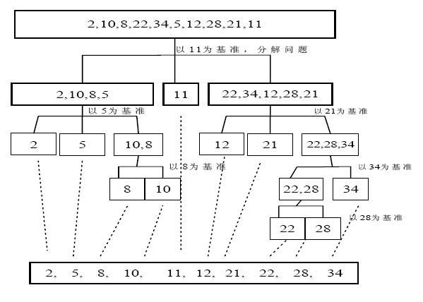

# DataStructuresAndAlgorithms
数据结构与算法

## 排序

### 算法的时间复杂度

#### 平均时间复杂度和最坏时间复杂度
- 平均时间复杂度是指所有可能的输入实例均以等概率出现的情况下，该算法的运行时间。
- 最坏情况下的时间复杂度称最坏时间复杂度。一般讨论的时间复杂度均是最坏情况下的时间复杂度。 这样做的原因是：最坏情况下的时间复杂度是算法在任何输入实例上运行时间的界限，这就保证了算法的运行时间不会比最坏情况更长。
- 平均时间复杂度和最坏时间复杂度是否一致，和算法有关(如图:)。

### 冒泡排序（Bubble Sort）
#### 基本思想
通过对待排序序列从前向后（从下标较小的元素开始）,依次比较相邻元素的值，若发现逆序则交换，使值较大的元素逐渐从前移向后部，就象水底下的气泡一样逐渐向上冒。
因为排序的过程中，各元素不断接近自己的位置，如果一趟比较下来没有进行过交换，就说明序列有序，因此要在排序过程中设置一个标志flag判断元素是否进行过交换。从而减少不必要的比较。

### 选择排序（Selection sort）
选择式排序也属于内部排序法，是从欲排序的数据中，按指定的规则选出某一元素，再依规定交换位置后达到排序的目的。
#### 选择排序思想:
选择排序（select sorting）也是一种简单的排序方法。它的基本思想是：第一次从arr[0]~arr[n-1]中选取最小值，与arr[0]交换，第二次从arr[1]~arr[n-1]中选取最小值，与arr[1]交换，第三次从arr[2]~arr[n-1]中选取最小值，与arr[2]交换，…，第i次从arr[i-1]~arr[n-1]中选取最小值，与arr[i-1]交换，…, 第n-1次从arr[n-2]~arr[n-1]中选取最小值，与arr[n-2]交换，总共通过n-1次，得到一个按排序码从小到大排列的有序序列。

### 插入排序（Insertion Sort）
插入式排序属于内部排序法，是对于欲排序的元素以插入的方式找寻该元素的适当位置，以达到排序的目的。
#### 插入排序法思想:
插入排序（Insertion Sorting）的基本思想是：把n个待排序的元素看成为一个有序表和一个无序表，开始时有序表中只包含一个元素，无序表中包含有n-1个元素，排序过程中每次从无序表中取出第一个元素，把它的排序码依次与有序表元素的排序码进行比较，将它插入到有序表中的适当位置，使之成为新的有序表
### 希尔排序（Shell Sort）
希尔排序是希尔（Donald Shell）于1959年提出的一种排序算法。希尔排序也是一种**插入排序**，它是简单插入排序经过改进之后的一个更高效的版本，也称为缩小增量排序。
#### 希尔排序法基本思想
希尔排序是把记录按下标的一定增量分组，对每组使用直接插入排序算法排序；随着增量逐渐减少，每组包含的关键词越来越多，当增量减至1时，整个文件恰被分成一组，算法便终止

### 快速排序（Quick sort）
#### 介绍
快速排序（Quicksort）是对冒泡排序的一种改进。基本思想是：通过一趟排序将要排序的数据分割成独立的两部分，其中一部分的所有数据都比另外一部分的所有数据都要小，然后再按此方法对这两部分数据分别进行快速排序，整个排序过程可以递归进行，以此达到整个数据变成有序序列

### 归并排序（Merge Sort）

#### 介绍
归并排序（MERGE-SORT）是利用归并的思想实现的排序方法，该算法采用经典的分治（divide-and-conquer）策略（分治法将问题分(divide)成一些小的问题然后递归求解，而治(conquer)的阶段则将分的阶段得到的各答案"修补"在一起，即分而治之)。

### 基数排序（radix sort）
#### 基数排序(桶排序)介绍
- 基数排序（radix sort）属于“分配式排序”（distribution sort），又称“桶子法”（bucket sort）或bin sort，顾名思义，它是通过键值的各个位的值，将要排序的元素分配至某些“桶”中，达到排序的作用

- 基数排序法是属于稳定性的排序，基数排序法的是效率高的稳定性排序法

- 基数排序(Radix Sort)是桶排序的扩展

- 基数排序是1887年赫尔曼·何乐礼发明的。它是这样实现的：将整数按位数切割成不同的数字，然后按每个位数分别比较。
#### 基本思想
将所有待比较数值统一为同样的数位长度，数位较短的数前面补零。然后，从最低位开始，依次进行一次排序。这样从最低位排序一直到最高位排序完成以后, 数列就变成一个有序序列
#### 说明
- 基数排序是对传统桶排序的扩展，速度很快.
- 基数排序是经典的空间换时间的方式，占用内存很大, 当对海量数据排序时，容易造成 OutOfMemoryError 。
- 基数排序时稳定的。[注:假定在待排序的记录序列中，存在多个具有相同的关键字的记录，若经过排序，这些记录的相对次序保持不变，即在原序列中，r[i]=r[j]，且r[i]在r[j]之前，而在排序后的序列中，r[i]仍在r[j]之前，则称这种排序算法是稳定的；否则称为不稳定的]
- 有负数的数组，我们不用基数排序来进行排序

### 堆排序（Heapsort）
#### 介绍
- 堆排序是利用堆这种数据结构而设计的一种排序算法，堆排序是一种选择排序，它的最坏，最好，平均时间复杂度均为O(nlogn)，它也是不稳定排序。

- 堆是具有以下性质的完全二叉树：每个结点的值都大于或等于其左右孩子结点的值，称为大顶堆, 注意 : 没有要求结点的左孩子的值和右孩子的值的大小关系。

- 每个结点的值都**小于**或**等于**其左右孩子结点的值，称为小顶堆

- 每个结点的值都**大于**或**等于**其左右孩子结点的值，称为大顶堆

  
#### 基本思想
- 将待排序序列构造成一个大顶堆
- 此时，整个序列的最大值就是堆顶的根节点。
- 将其与末尾元素进行交换，此时末尾就为最大值。
- 然后将剩余n-1个元素重新构造成一个堆，这样会得到n个元素的次小值。如此反复执行，便能得到一个有序序列了。

### 对比

